The Lepton Cookbook
===================

Lepton allows users to create a very diverse range of effects.

Let's look at some example particle system setups used to create the example
effects (in the ``examples/`` directory).

Bouncy
------

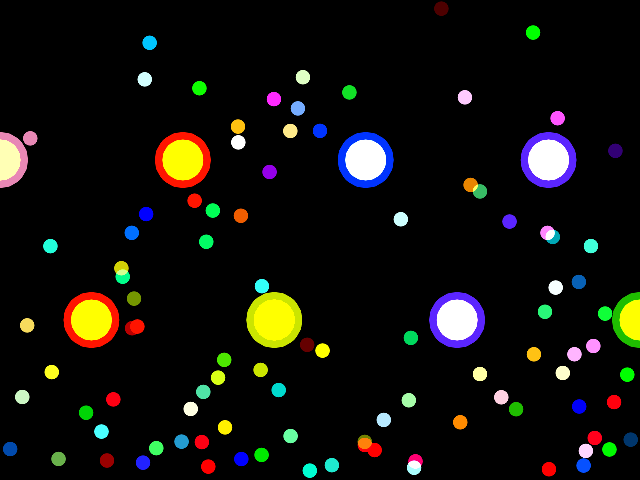

This example uses an array of :class:`.Sphere`-shaped :class:`.Bounce`
controllers to bounce ball particles that otherwise fall under
:class:`.Gravity`.

100 ball particles are generated once within the bounds of the screen; a
:class:`.StaticEmitter` is created for the purpose but not bound to the group,
and thus does not continue to emit.

An :class:`.AABox` Bounce controller around the domain of the screen ensures
that balls can never leave the screen. With no lifetime or death they bounce
forever.

Additionally, the ``callback`` attribute of the bounce controller is used to
change the color of each bumper when a ball bounces off it.

The bumpers are drawn using custom OpenGL code while the balls are drawn with
the :class:`.PointRenderer`.

Bubbles
-------

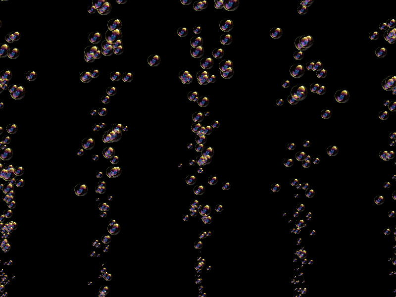

A single :class:`.StaticEmitter` is configured to spawn 80 bubble particles a
second at one of a set of start points, with random sizes and velocities.

The bubbles accelerate upwards under a constant buoyancy, applied by a
:class:`.Gravity` controller.

A :class:`.Growth` controller causes the bubbles to grow at a constant rate.

Each bubble is killed after 7 seconds by a :class:`.Lifetime` controller.

Fire
----
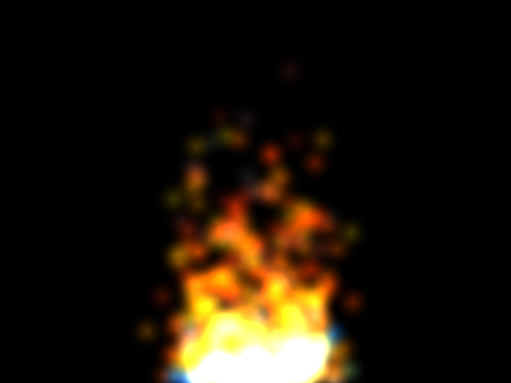

Particles are emitted at a random point long a line at the bottom of the screen
and accelerate upwards under a constant ":class:`.Gravity`" force. Each
particle starts with a randomized velocity and initial age.

A :class:`.ColorBlender` controller changes the color of each particle as it
ages, progressing through a number of colours:

1. Blue
2. Teal
3. Yellow
4. Red
5. Orange
6. Gray

Crucially, the particles are drawn in OpenGL with additive blending, which is
very typical for particles that appear to emit light::

    glBlendFunc(GL_SRC_ALPHA,GL_ONE)

The means that the base of the fire is a bright, blended white and not a
mixture of blue, teal and yellow.

Fireworks
---------
.. image:: _static/fireworks.png

Each explosion creates two groups: the sparks group, which is populated with
particles immediately, and the trails group. A :class:`.PerParticleEmitter` in
emits a trail of particles into the trails group for each particle in the
sparks group.

To ensure that the sparks fly out evenly, their velocities are randomly
distributed on the surface of a :class:`.Sphere` domain.

A subtle element is that the :class:`.Movement` controller applies more
``damping`` to the trails than to the sparks. This is consistent with a higher
drag for these particles. This gives the effect that the sparks feel a little
"heavier" than the tails. To use an analogy, this is like the difference
between marbles and confetti falling through the air.

Flyby
-----

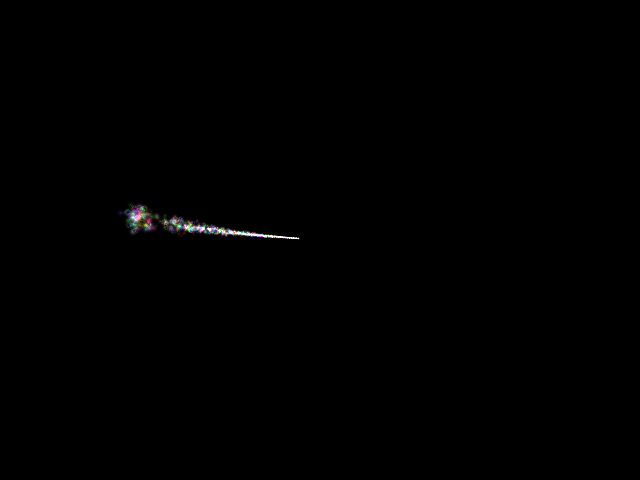

This comet is modelled as a single :class:`.StaticEmitter` that is moved every
frame by Python code in a Lissajous orbit.

Domains
-------

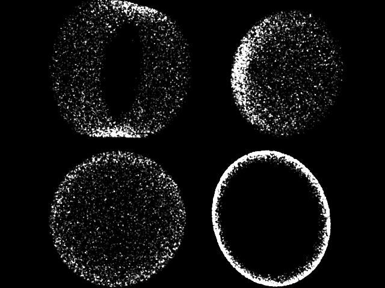

This example generates very short-lived, static particles within four domains:
a :class:`.Sphere`, :class:`.Disc`, :class:`.Cylinder` and :class:`.Cone`.

Each group is drawn with a model matrix that rotates the model over time.

Additionally, each emitter domain's ``inner_radius`` oscillates sinusoidally,
at times emitting within the full volume of the domain and sometimes purely
over the outer surface.

Letters
-------

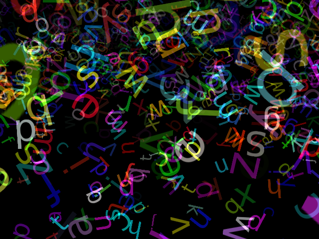

Particles are emitted from a single :class:`.AABox`-shaped
:class:`.StaticEmitter` above and in front of the camera, with a randomized
velocity towards the camera.

The different letters are chosen by the :class:`.SpriteTexturizer`. A texture
is supplied that contains all the different letters with different texture
coordinates (a texture atlas). The list of texture coordinates for each letter
is passed to the ``SpriteTexturizer`` which picks between these for each
particle.

'Splode
-------

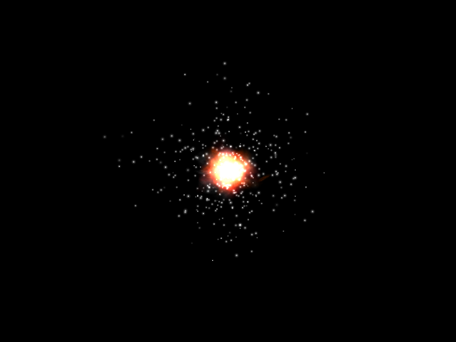

This explosion is created using two :class:`ParticleGroups <.ParticleGroup>` /
:class:`Emitters <.StaticEmitter>`:

* The sparks are emitted outwards at high, random velocity.
* The fire is emitted outwards at a slower velocity, in a number of colours.
  These particles also rotate in random directions.

Both sets of particles fade over time. Once again, these particles are drawn
with additive blending.

Vortex
------

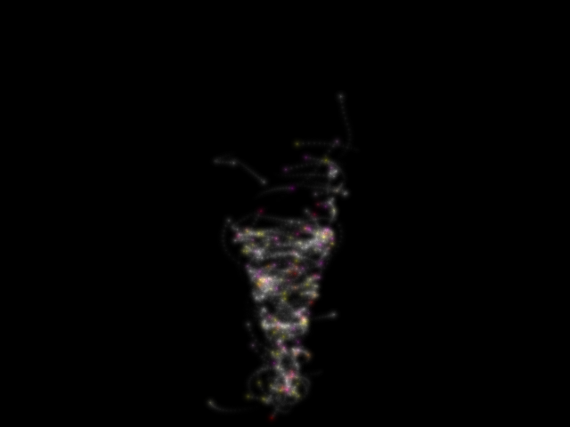

This complex effect consists of particles attracted by a :class:`.Cone`-shaped
:class:`.Magnet`. Short particle trails are added with the same
:class:`.PerParticleEmitter` technique as for the Fireworks example.

To ensure particles circulate, two :class:`.Drag` controllers push particles
in opposing directions. The front  controller pushes particles to the right,
while the back controller pushes particles to the left. This sets up the "spin"
of the vortex.

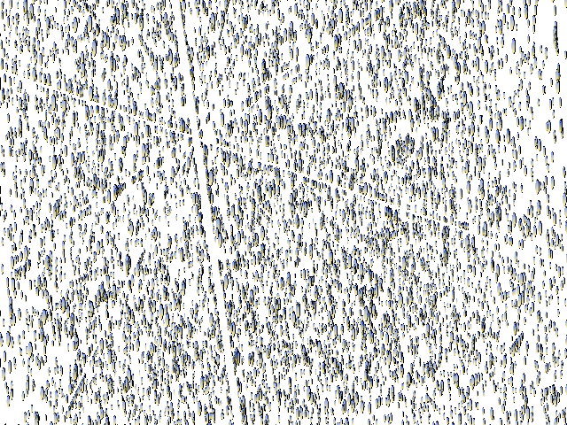
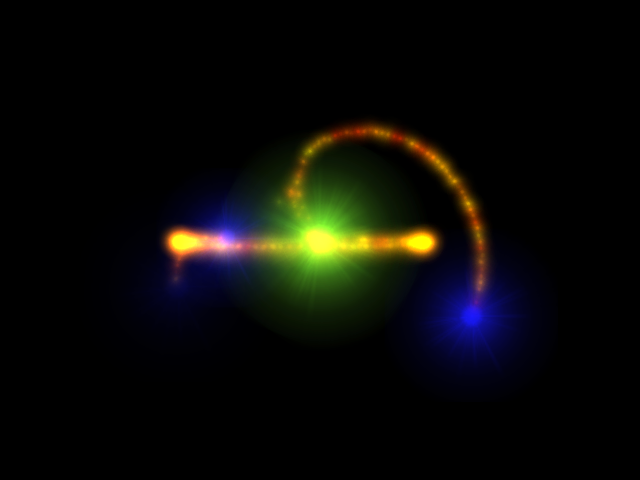
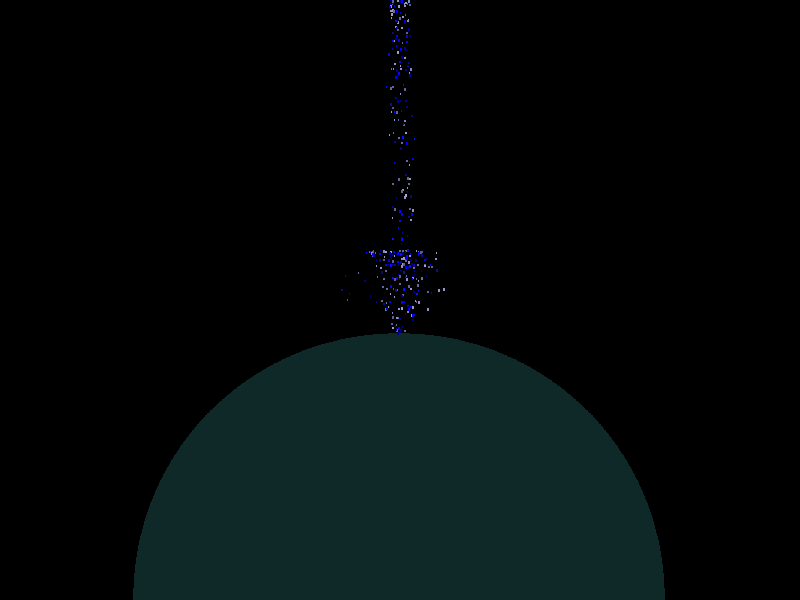
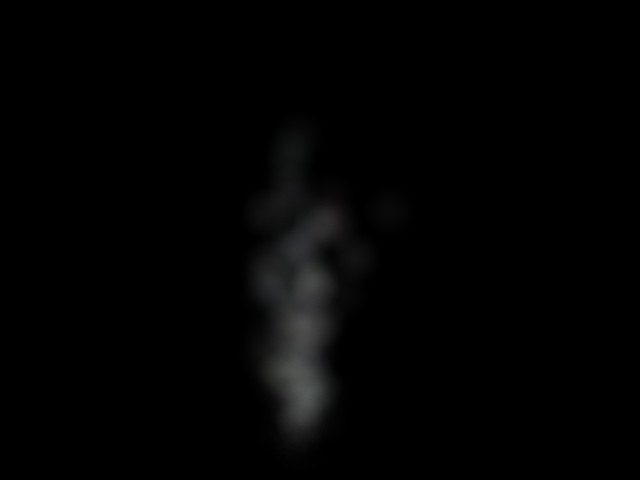
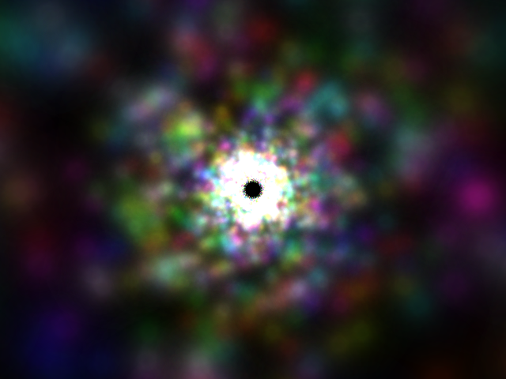

