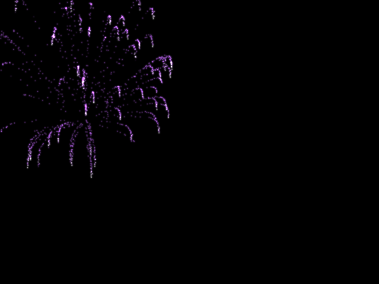
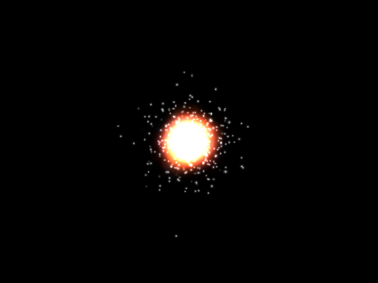

The Lepton Cookbook
===================

Lepton allows users to create a very diverse range of effects.

Let's look at some example particle system setups used to create the example
effects (in the ``examples/`` directory).

Bouncy
------

This example uses an array of :class:`.Sphere`-shaped :class:`.Bounce`
controllers to bounce ball particles that otherwise fall under
:class:`.Gravity`.

100 ball particles are generated once within the bounds of the screen; a
:class:`.StaticEmitter` is created for the purpose but not bound to the group,
and thus does not continue to emit.

An :class:`.AABox` Bounce controller around the domain of the screen ensures
that balls can never leave the screen. With no lifetime or death they bounce
forever.

Additionally, the ``callback`` attribute of the bounce controller is used to
change the color of each bumper when a ball bounces off it.

The bumpers are drawn using custom OpenGL code while the balls are drawn with
the :class:`.PointRenderer`.

Bubbles
-------

.. image:: _static/bubbles.png

Fire
----
.. image:: _static/fire.png

Fireworks
---------

Flyby
-----
.. image:: _static/flyby.png
.. image:: _static/generate.png
.. image:: _static/letters.png
.. image:: _static/logo.png

.. image:: _static/splode2d.png

